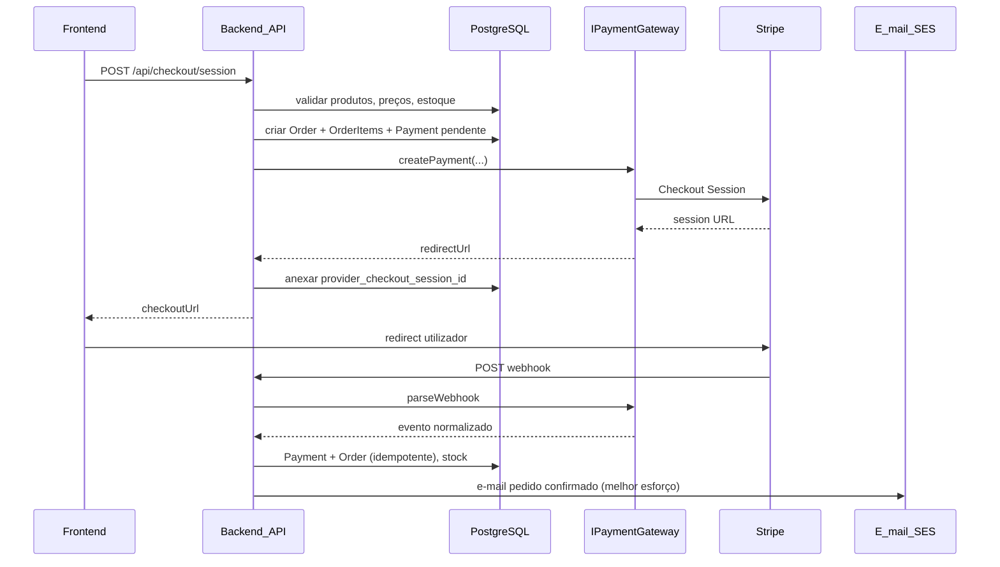

# Pagamentos — arquitetura agnóstica de gateway (Stripe como 1ª implementação)

Decisão: **provedor atual = Stripe**. Requisito transversal: **código e modelo de dados não devem depender de Stripe** (nem de outro gateway) na camada de domínio e de persistência de **produtos** e **vendas**.

Este documento define **fronteiras**, **entidades no nosso banco** e **onde o Stripe pode aparecer**.

---

## Princípios

1. **Fonte de verdade**  
   - **Catálogo** (produtos, SKU, preço de venda, estoque lógico, linha crochê/couro, etc.): **sempre PostgreSQL** (via Prisma), não o dashboard do Stripe.  
   - **Pedido (venda)**: **sempre PostgreSQL** — itens, quantidades, preços **congelados no momento da compra**, frete, dados de entrega, estados do pedido.  
   - **Pagamento**: registro no nosso banco como **tentativa/cobrança** ligada ao pedido; o gateway guarda o que for necessário para conciliação, mas **não substitui** o pedido.

2. **Gateway = adaptador**  
   - Casos de uso dependem apenas da porta [`IPaymentGateway`](../backend/src/data/protocols/payment/PaymentGateway.ts).  
   - **Stripe** fica em [`StripePaymentGateway`](../backend/src/infra/payment/StripePaymentGateway.ts), traduzindo chamadas e webhooks para tipos normalizados.

3. **Webhooks**  
   - `POST /api/webhooks/payment` recebe o corpo **bruto** JSON (middleware `express.raw` antes de `express.json()` no servidor).  
   - O adaptador valida a assinatura e devolve eventos normalizados; [`ProcessPaymentWebhookUsecase`](../backend/src/data/usecases/commerce/ProcessPaymentWebhookUsecase.ts) atualiza **Payment** e **Order** de forma **idempotente**.

4. **IDs externos**  
   - Colunas `provider` + `provider_payment_id` / sessão de checkout para auditoria. Chave de negócio: **`order.id`** interno.

5. **Troca de gateway**  
   - Novo adaptador que honre `IPaymentGateway`; alterar factory / `PAYMENT_PROVIDER`. Regras de pedido e produto permanecem iguais.

---

## Modelo de dados (implementado)

Definido em [`Commerce.prisma`](../backend/prisma/models/Commerce.prisma) e migração [`20260325120000_commerce`](../backend/prisma/migrations/20260325120000_commerce/migration.sql).

| Entidade | Responsabilidade |
|----------|------------------|
| **Product** | Slug, nome, preço em centavos, estoque, linha, `active`, imagem, etc. |
| **Order** | Status, totais persistidos, frete, snapshot de endereço (JSON), e-mail do cliente. |
| **OrderItem** | Produto, quantidade, preço unitário e nome no momento da compra. |
| **Payment** | Provedor, IDs externos, status, valor, moeda. |
| **ProcessedWebhookEvent** | Idempotência de eventos de webhook. |

O valor enviado ao Stripe é calculado no servidor a partir dos produtos no banco (`prepareCheckoutCart`), não a partir de preços enviados só pelo browser.

---

## API HTTP

| Método | Caminho | Descrição |
|--------|---------|-----------|
| `POST` | `/api/checkout/session` | Corpo JSON validado por [`createCheckoutSchema`](../backend/src/presentation/validations/commerce/createCheckoutSchema.ts): `items[]` (`productSlug`, `quantity`), `customerEmail`, `customerName?`, `shipping?`. Resposta **201**: `{ checkoutUrl, orderId }`. |
| `POST` | `/api/webhooks/payment` | Webhook do provedor (Stripe); requer headers e corpo brutos intactos. |

**CORS:** o checkout no browser chama a API diretamente; inclua o origin do frontend em `ALLOWED_ORIGINS` (valores separados por vírgula, sem espaços desnecessários — o servidor faz trim). O middleware responde **`OPTIONS`** com **204** e expõe métodos/headers usados em `POST` + JSON (`Content-Type`, `Authorization`). Ver [`expressCorsAdapter.ts`](../backend/src/main/adapters/express/expressCorsAdapter.ts) e [`producao-checklist.md`](./producao-checklist.md).

---

## Fluxo resumido (checkout)

Após atualizar o pedido como pago, o caso de uso tenta enviar o e-mail transacional; **falhas de SES não falham o webhook** (evita reentregas infinitas enquanto o pedido já foi confirmado).

---

## Frontend

- Sem chave secreta; o utilizador paga no **Stripe Checkout** (hospedado).  
- Chamada: `POST {NEXT_PUBLIC_API_BASE_URL}/api/checkout/session` — ver [`frontend/src/lib/create-checkout-session.ts`](../frontend/src/lib/create-checkout-session.ts) e [`frontend/.env.example`](../frontend/.env.example).  
- **Slug:** o `product.id` da vitrine estática coincide com o `slug` no seed Prisma (`backend/prisma/seed.ts`). Itens do carrinho com a mesma peça em cores diferentes são **agregados por slug** antes do POST.  
- Após pagamento, o Stripe redireciona para `CHECKOUT_SUCCESS_URL` (deve conter `{CHECKOUT_SESSION_ID}`). Página de destino: [`/checkout/success`](../frontend/src/app/checkout/success/page.tsx).

---

## Variáveis de ambiente (backend)

Ver [`backend/.env.example`](../backend/.env.example):

- `PAYMENT_PROVIDER=stripe`  
- `STRIPE_SECRET_KEY`, `STRIPE_WEBHOOK_SECRET`  
- `CHECKOUT_SUCCESS_URL` (com `{CHECKOUT_SESSION_ID}`), `CHECKOUT_CANCEL_URL`  
- `DATABASE_URL`, `ALLOWED_ORIGINS`

---

## Onde o Stripe é permitido (code review)

- **Permitido:** `infra/payment/*`, `STRIPE_*`, SDK `stripe`, validação de assinatura do webhook.  
- **Evitar em domínio / casos de uso “puros”:** import de `stripe` ou tipos específicos do SDK.  
- **Frontend:** nunca enviar dados de cartão ao nosso servidor.

---

## Referências no repositório

- Porta: [`PaymentGateway.ts`](../backend/src/data/protocols/payment/PaymentGateway.ts)  
- Repositório commerce: [`CommercePrismaRepository.ts`](../backend/src/infra/prisma/CommercePrismaRepository.ts)  
- Rotas: [`commerceRoutes.ts`](../backend/src/main/routes/commerceRoutes.ts), webhook em [`server.ts`](../backend/src/main/server.ts)  
- Checklist geral: [`producao-checklist.md`](./producao-checklist.md)

---

*Documento vivo: alinhar com novas rotas ou segundo provedor quando existirem.*
